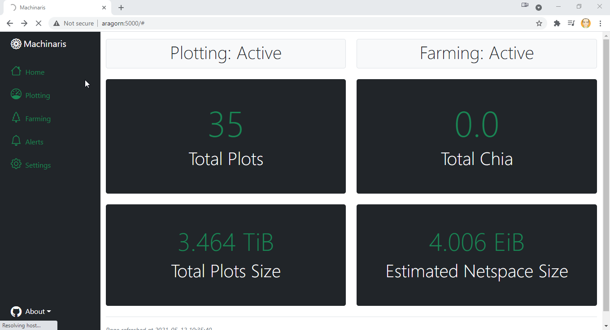
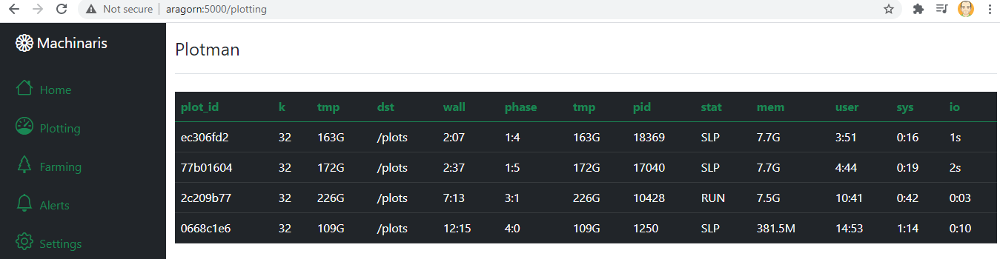

# machinaris

A pure-Docker solution for plotting and farming the Chia™ cryptocurrency.

To get started with Machinaris, follow an install guide for your platform Windows, Linux, Macintosh, and Unraid.

## Plotting View

The [plotman](https://github.com/ericaltendorf/plotman) commandline plotting manager is used manage parallel operations, also exposed via the Machinaris web interface:

## Farming View
[chia-docker](https://github.com/orgs/Chia-Network/packages/container/package/chia): Machinaris builds upon the offical docker image, so all Farming is done via the official binaries.

TODO: Put farming screenshot here.

## Alerts

*Coming Soon...*

## Setup

TODO: Screenshots of setup.  Links to wiki.

## Trademark Notice
CHIA NETWORK INC, CHIA™, the CHIA BLOCKCHAIN™, the CHIA PROTOCOL™, CHIALISP™ and the “leaf Logo” (including the leaf logo alone when it refers to or indicates Chia), are trademarks or registered trademarks of Chia Network, Inc., a Delaware corporation.  

*There is no affliation between this Machinaris project and the main Chia Network project.*
