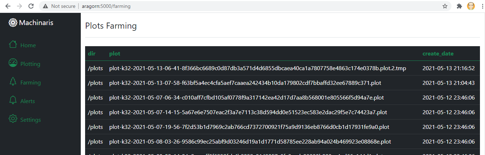
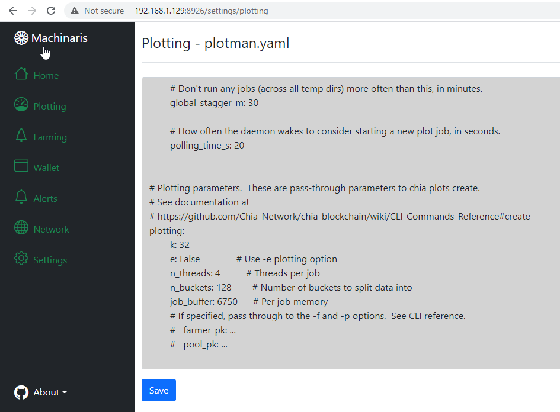
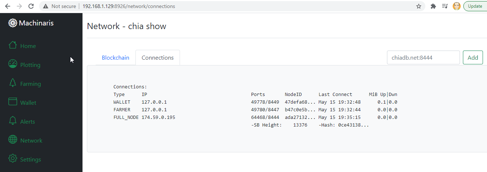

# machinaris

A pure-Docker solution for plotting and farming the Chia™ cryptocurrency.  Currently in an [early *beta*](https://github.com/users/guydavis/packages/container/package/machinaris)!

To get started with Machinaris, follow an install guide for your platform: [Windows](https://github.com/guydavis/machinaris/wiki/Windows), [Linux](https://github.com/guydavis/machinaris/wiki/Linux), [Macintosh](https://github.com/guydavis/machinaris/wiki/MacOS), [Unraid](https://github.com/guydavis/machinaris/wiki/Unraid), and [others](https://github.com/guydavis/machinaris/wiki/Generic).

## Plotting View

The [plotman](https://github.com/ericaltendorf/plotman) CLI is used manage staggered/parallel plotting jobs, also exposed via the Machinaris web interface:

## Farming View

[chia-docker](https://github.com/orgs/Chia-Network/packages/container/package/chia): Machinaris builds upon the offical docker image, so all Farming is done via the official binaries.

## Alerts

*Coming Soon...*

## Setup

Configuration updates for Chia and Plotman are available in the WebUI.  

Details on Blockchain and Connection status as well:

## Trademark Notice
CHIA NETWORK INC, CHIA™, the CHIA BLOCKCHAIN™, the CHIA PROTOCOL™, CHIALISP™ and the “leaf Logo” (including the leaf logo alone when it refers to or indicates Chia), are trademarks or registered trademarks of Chia Network, Inc., a Delaware corporation.  

*There is no affliation between this Machinaris project and the main Chia Network project.*
